# Setting up R and RStudio in Windows

## Running as Administrator

- When you run the installers, make sure to run them as administrator.
- Select the file, right click and choose **Run as administrator**  
  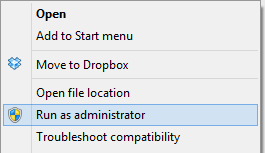

## Installing R

- Open your browser and go to http://cran.r-project.org/
- Click on `Download R for Windows`  
  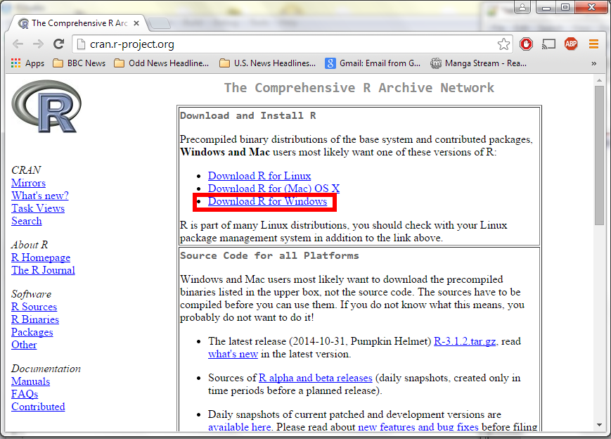
- Click on `base`  
  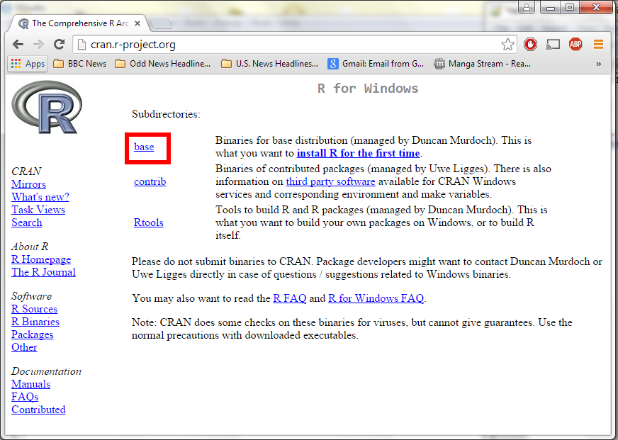
- Click on `Download R 3.1.2 for Windows`  
  
- Open and run the file you just downloaded `R-3.1.2-win.exe`
  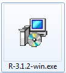
- There is no need to change the default installation!

|                            .                            |                            .                            |                            .                            |
| :-----------------------------------------------------: | :-----------------------------------------------------: | :-----------------------------------------------------: |
| 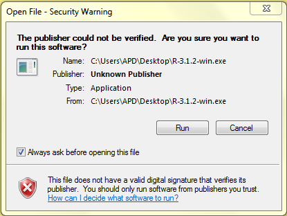 | 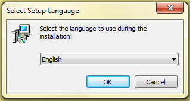 |  |
|                          **1**                          |                          **2**                          |                          **3**                          |
|  |  | 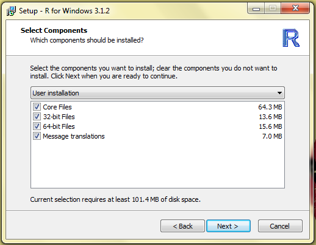 |
|                          **4**                          |                          **5**                          |                          **6**                          |
| 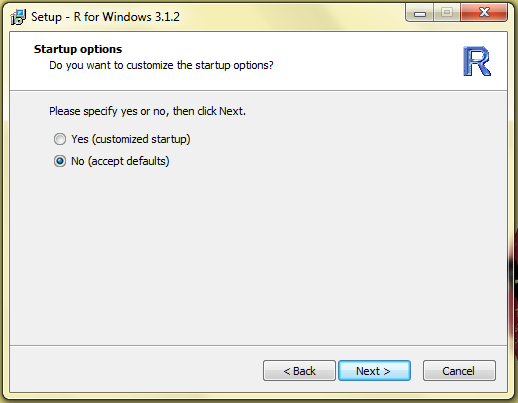 |  |  |
|                          **7**                          |                          **8**                          |                          **9**                          |
| 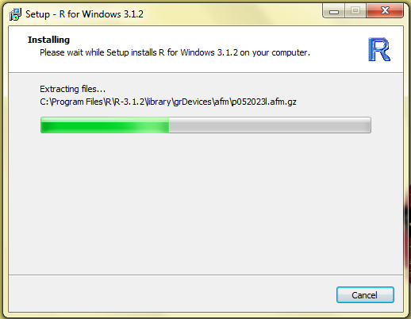 | 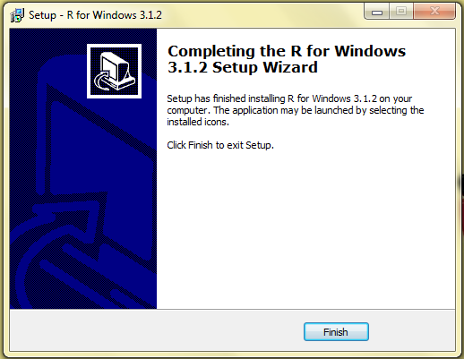 |                        **DONE**                         |
|                         **10**                          |                         **11**                          |                                                         |

- Please make sure you install the latest version of R (R version 3.1.2).

## Installing Rtools

Now we need to install Rtools

- Open your browser and go to http://cran.r-project.org/
- Click on `Download R for Windows`  
  
- Click on `Rtools`  
  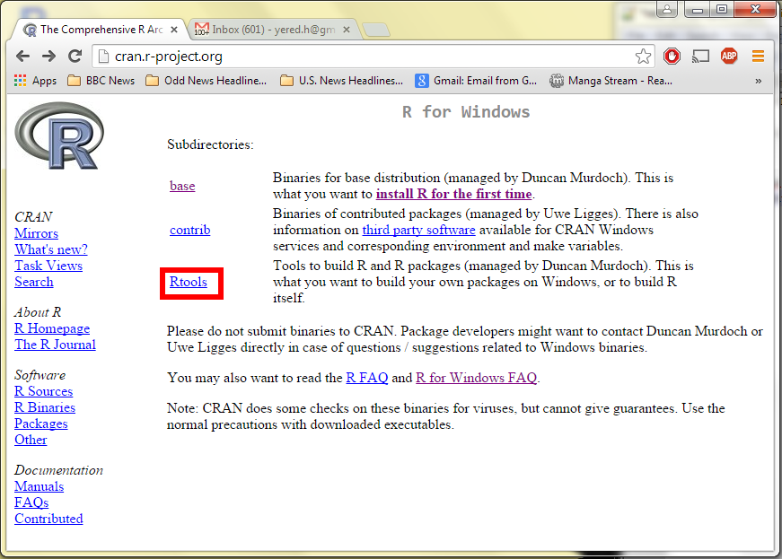
- Download `Rtools31.exe`  
  
- Open and run the file you just downloaded `Rtools31.exe`
  
- Again, there is no need to change the defaults

|                          .                           |                          .                           |                          .                           |
| :--------------------------------------------------: | :--------------------------------------------------: | :--------------------------------------------------: |
|  |  | 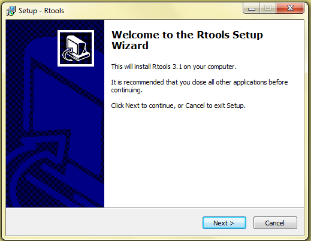 |
|                        **1**                         |                        **2**                         |                        **3**                         |
| 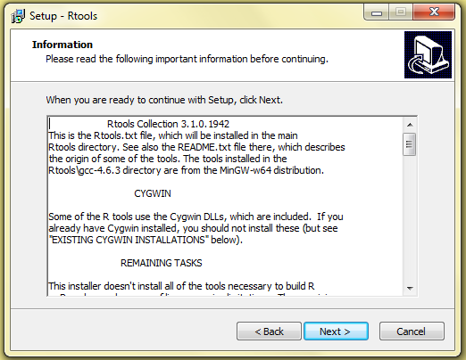 | 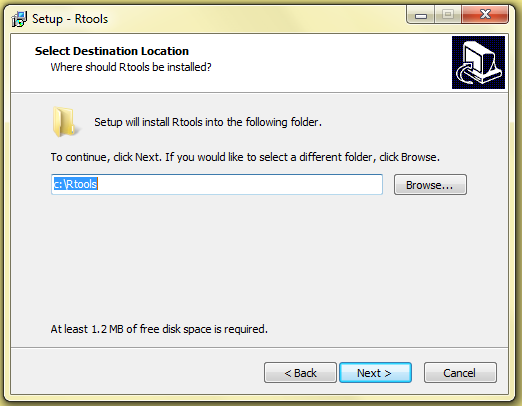 |  |
|                        **4**                         |                        **5**                         |                        **6**                         |
| 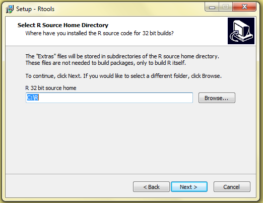 | 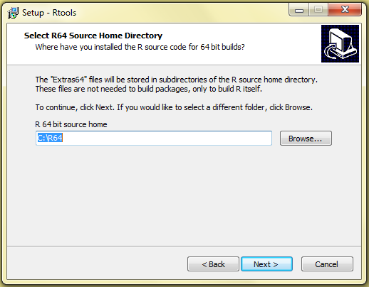 | 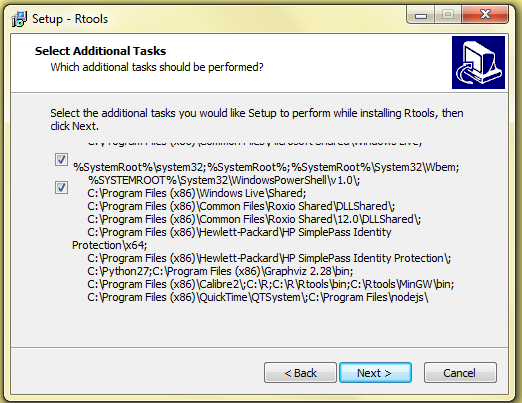 |
|                        **7**                         |                        **8**                         |                        **9**                         |
|  |  |  |
|                        **10**                        |                        **11**                        |                        **12**                        |
| 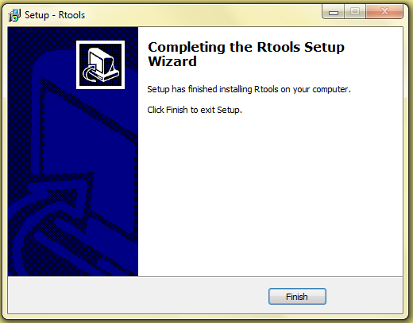 |                       **DONE**                       |                                                      |
|                        **13**                        |                        **14**                        |                                                      |

## Installing RStudio

- If you have already installed RStudio, before you skip this section check if you are using the right R version. Go to `Tools/Global Options`. Make you sure you have `R-3.1.2` under R version


- Go to http://www.rstudio.com/ and click on `Desktop`

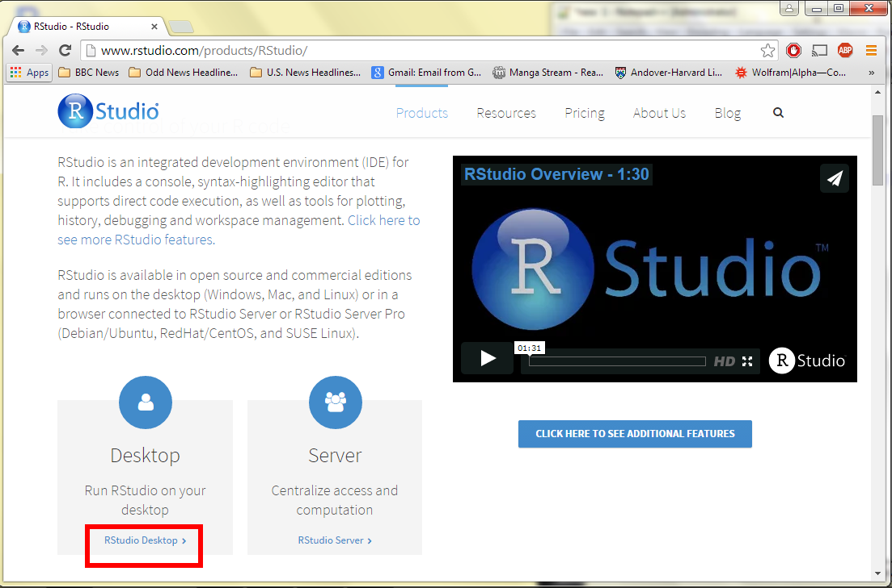

- Select `DOWNLOAD RSTUDIO DESKTOP`

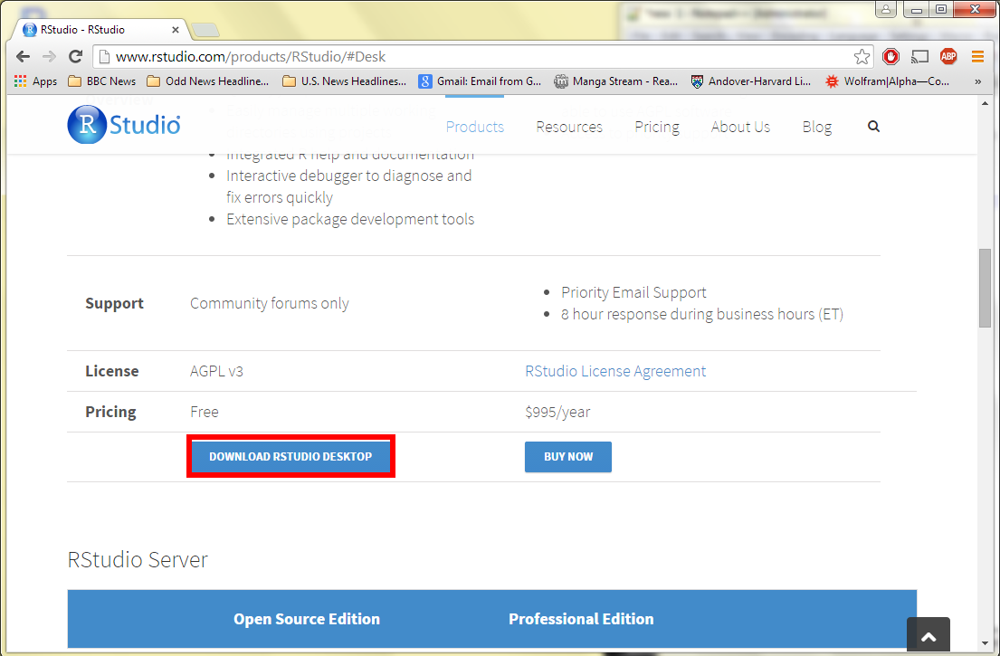

- Download the installer for Windows

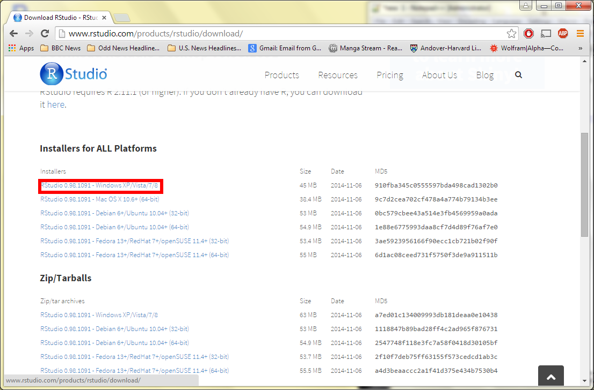

- Open and run the file you just downloaded `RStudio-0.98.1091.exe`


- You don't have to change any of the defaults for the installation

|                           .                           |                           .                           |                           .                           |
| :---------------------------------------------------: | :---------------------------------------------------: | :---------------------------------------------------: |
|  |  |  |
|                         **1**                         |                         **2**                         |                         **3**                         |
|  |  |                       **DONE**                        |
|                         **4**                         |                         **5**                         |                         **6**                         |

## Installing devtools

- Open Rstudio, in the **Files/Plots/Packages/Help** panel, select **Packages** and then click on **Install**
  

- Type `devtools` under **Packages**, make sure you spell the name of the package correctly. Then, click on **Install**  
  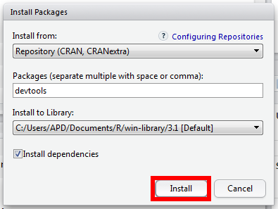

- Alternatively, you can run the following command in the console:

```
install.packages("devtools")
```

## Installing packages from GitHub

We are ready to install R packages from GitHub

- First we need to load the `devtools` package

```r
library(devtools)
```

- Now we can install the `gapminder` package.

```r
install_github("jennybc/gapminder")
```

## License

http://opensource.org/licenses/MIT
